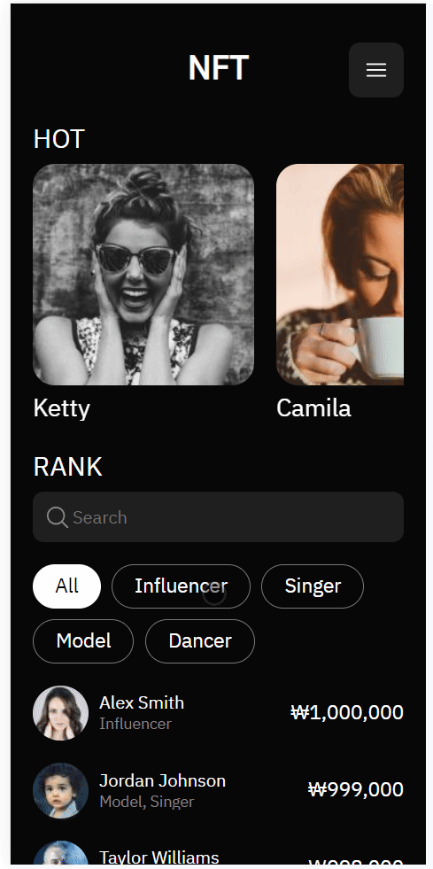
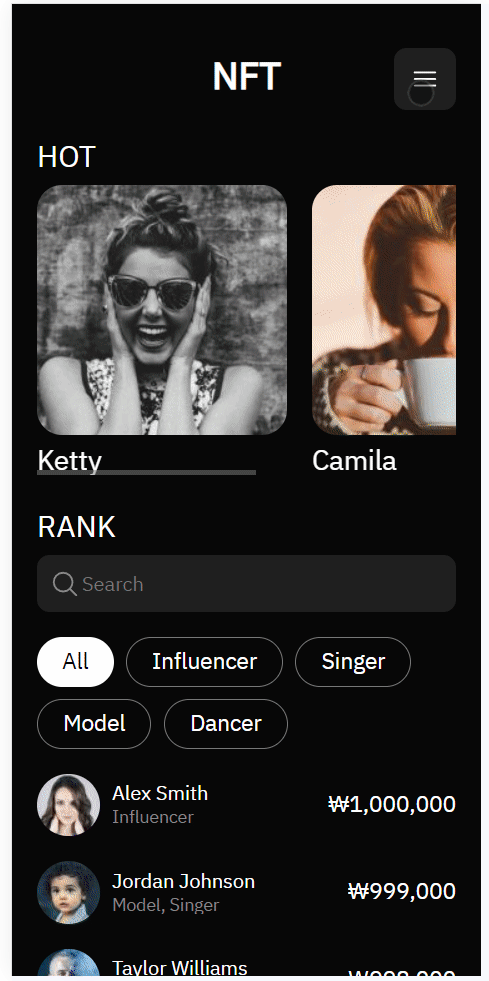

# 소개

### 인플루언서나 셀럽들이 자신을 NFT 작품으로 만들어 판매할 수 있다는 컨셉의 사이트 (실제 서비스 X). 그들의 랭킹을 보여주고, 작품들의 구매 정보를 제공.

[사이트 링크](https://nft-creator-ranking.vercel.app/)

> 모바일 화면에 최적화되어 있습니다.

# 동작 화면

 메인 화면. 최근 인기 크리에이터들과 크리에이터 랭킹을 확인할 수 있다.

 랭킹에서는 태그로 검색하거나 이름으로 검색할 수 있다.

 화면 끝에 도달했을 때 추가로 데이터를 불러오는 무한 스크롤을 구현했다. `React-query`의 `useInfiniteQuery` 훅을 활용했다.

 크리에이터 상세 페이지. NFT 작품들의 이미지와 가격 그래프를 확인할 수 있다. Image Carousel은 `React Slick`을 사용하고 CSS를 커스텀 했다. 가격 그래프는 `Recharts`를 활용했다.

 마이페이지. 이름과 자신의 SNS 링크를 수정할 수 있고, 자신의 태그를 추가, 삭제할 수 있다. 또한 자신이 생성한 작품들을 확인할 수 있다.
